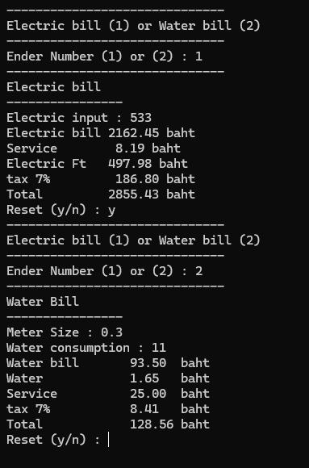

# Utility Bill Calculator (C Language)

A console-based utility bill calculator developed in C that automatically calculates electricity and water bills using progressive rate structures. The program includes service charges, Ft (Fuel Adjustment Charge), VAT (7%), and generates expense comparisons and average cost summaries.

The calculation formulas are based on Thailand's utility billing rates (2022 version).

---

## 🌟 Features

### Service Selection System

* Calculate either:

  * Electricity bills (Option 1)
  * Water bills (Option 2)
* Both services are available within a single application.

### Progressive Electricity Billing

* Calculates electricity costs based on tiered consumption rates.
* Includes:

  * Monthly service charge
  * Ft (Fuel Adjustment Charge)
  * VAT (7%)

### Water Bill Calculation

* Supports multiple water meter sizes.
* Applies different service fees based on meter size.
* Uses loops to calculate progressive water rates.

### Repeated Calculation System

* Allows users to perform multiple calculations without restarting the program.

### Expense Summary & Comparison

* Calculates the average cost of all transactions.
* Compares water and electricity expenses.
* Displays which utility costs more and by how much.

---

## 🧮 Calculation Formula

The system uses the following formula:

Total=(Bill+Service+Addition)\times1.07

Where:

### Electricity Bill

```text
Addition = Ft × Electricity Units
```

### Water Bill

```text
Addition = Raw Water Charge × Water Units
```

---

## 🚀 Getting Started

### Prerequisites

* GCC Compiler (e.g., MinGW)
* Or any C-compatible IDE such as:

  * Code::Blocks
  * Visual Studio Code
  * Dev-C++

### Compile the Program

```bash
gcc main.c -o bill_calculator
```

### Run the Program

#### Windows

```bash
bill_calculator.exe
```

#### Linux / macOS

```bash
./bill_calculator
```

---

## 💡 Example Test Cases

### Example 1: Electricity Bill Calculation

**Input**

```text
Electricity Units: 533
```

**Expected Output**

```text
Electric Bill : 2162.45 baht
Service Charge: 8.19 baht
Electric Ft   : 497.98 baht
VAT (7%)      : 186.80 baht
Total         : 2855.43 baht
```

---

### Example 2: Water Bill Calculation

**Input**

```text
Meter Size      : 0.3
Water Usage     : 11
```

**Expected Output**

```text
Water Bill      : 93.50 baht
Raw Water Charge: 1.65 baht
Service Charge  : 25.00 baht
VAT (7%)        : 8.41 baht
Total           : 128.56 baht
```

---

## 📸 Program Preview



---

## 📂 Code Structure

### main()

Controls:

* Main menu navigation
* Switch-case selection
* Looping system for repeated calculations
* Average cost and comparison summaries

### calElectric()

Calculates electricity bills using:

* Progressive rate structures
* Conditional statements (`if-else`)
* Ft charge calculations
* VAT calculations

### calWater()

Calculates water bills using:

* Meter-size validation
* Progressive water rate calculations
* Loop-based billing logic
* Service charge determination

---

## 🎯 Learning Objectives

This project was developed to practice fundamental C programming concepts, including:

* Functions
* Conditional Statements (`if-else`)
* Switch Case
* Loops
* Modular Programming
* Mathematical Calculations
* User Input and Output Handling

It serves as a practical exercise for understanding control structures and function decomposition in the C programming language.

---

## 👤 Author

**Sarochinee Bunyarit**

---
# Utility Bill Calculator (C Language)

โปรแกรมคำนวณค่าน้ำประปาและค่าไฟฟ้าอัตโนมัติ พัฒนาด้วยภาษา C โดยคำนวณตามโครงสร้างอัตราก้าวหน้า (Progressive Rate) พร้อมคิดค่าบริการ ค่า Ft และภาษีมูลค่าเพิ่ม (VAT 7%) ให้อย่างเสร็จสรรพ พร้อมสรุปเปรียบเทียบค่าใช้จ่ายตอนท้าย (สูตรคำนวณปี 2565)

## 🌟 คุณสมบัติระบบ (Features)
- **ระบบเลือกบริการ:** สามารถเลือกคำนวณค่าไฟฟ้า (กด 1) หรือค่าน้ำประปา (กด 2) ได้ในโปรแกรมเดียว
- **คำนวณค่าไฟฟ้าอัตราก้าวหน้า:** แบ่งคิดตามช่วงหน่วยการใช้งานจริง พร้อมคำนวณค่า Ft, ค่าบริการรายเดือนขั้นพื้นฐาน และภาษี 7%
- **คำนวณค่าน้ำประปาตามขนาดมิเตอร์:** รองรับการคำนวณตามขนาดมิเตอร์ที่แตกต่างกัน (คิดค่าบริการแยกตามขนาด) และคิดค่าน้ำแบบอัตราก้าวหน้าโดยใช้ Loop
- **ระบบคำนวณซ้ำ (Looping System):** รองรับการคำนวณหลายๆ ครั้งติดต่อกันได้โดยไม่ต้องเปิดโปรแกรมใหม่
- **ระบบสรุปผลและเปรียบเทียบค่าใช้จ่าย:** - คำนวณค่าใช้จ่ายเฉลี่ย (Average Cost) จากการคำนวณทั้งหมด
  - เปรียบเทียบผลลัพธ์ว่าระหว่างค่าน้ำกับค่าไฟฟ้า อะไรมีค่าใช้จ่ายสูงกว่ากันและสูงกว่าอยู่เท่าใด

## 🧮 รายละเอียดการคำนวณทางคณิตศาสตร์
ระบบใช้สูตรการคำนวณพื้นฐานดังนี้:

$$Total = (Bill + Service + Addition) \times 1.07$$

* **สำหรับไฟฟ้า:** `Addition` = ค่า $Ft \times หน่วยไฟฟ้า$ ที่ใช้
* **สำหรับน้ำประปา:** `Addition` = ค่าน้ำดิบดิสชาร์จ ($0.15 \times หน่วยน้ำ$)

---

## 🚀 วิธีการดาวน์โหลดและรันโปรแกรม (Getting Started)

### สิ่งที่ต้องมีก่อน (Prerequisites)
- GCC Compiler (เช่น MinGW สำหรับ Windows) หรือโปรแกรม IDE อย่าง VS Code / Code::Blocks

### ขั้นตอนการรันโปรแกรมบน Terminal
1. โคลนโปรเจคหรือดาวน์โหลดไฟล์โค้ดลงเครื่อง
2. เปิด Terminal แล้วใช้คำสั่งเพื่อ Compile ซอร์สโค้ด (สมมติตั้งชื่อไฟล์ว่า `main.c`):
   ```bash
   gcc main.c -o bill_calculator
3. รันไฟล์โปรแกรมที่ทำการ Compile แล้ว
   - Windows: bill_calculator.exe
   - Mac/Linux: ./bill_calculator
## 💡 ตัวอย่างการกรอกข้อมูลเพื่อทดสอบระบบ (Test Cases)

คุณสามารถใช้ค่าตัวอย่างเหล่านี้ในการทดสอบความถูกต้องของโปรแกรม:

### ตัวอย่างที่ 1: คำนวณค่าไฟฟ้า (กดเลือกหมายเลข 1)
* **ค่าที่กรอก (Electric input):** `533`
* **ผลลัพธ์ที่ควรได้บนหน้าจอ:**
  * Electric bill: `2162.45` baht
  * Service: `8.19` baht
  * Electric Ft: ` 497.98` baht
  * tax 7%: `186.80` baht
  * **Total:** `2855.43` baht

### ตัวอย่างที่ 2: คำนวณค่าน้ำประปา (กดเลือกหมายเลข 2)
* **ขนาดมิเตอร์ (Meter Size):** `0.3` (ระบบจะคิดค่าบริการพื้นฐานที่ 25.00 บาท)
* **หน่วยที่ใช้ (Water consumption):** `11`
* **ผลลัพธ์ที่ควรได้บนหน้าจอ:**
  * Water bill: `93.50` baht
  * Water (ค่าน้ำดิบ): `1.65` baht
  * Service: `25.00` baht
  * tax 7%: `8.41` baht
  * **Total:** `128.56` baht
    

    
## 📂 โครงสร้างภายในโค้ด (Code Structure)
- main() : ฟังก์ชันหลัก ควบคุมหน้าเมนู (Switch Case), ระบบวนลูปรับค่าใหม่ และประมวลผลเปรียบเทียบ/ค่าเฉลี่ยตอนท้ายโปรแกรม
- calElectric() : ฟังก์ชันคำนวณค่าไฟฟ้าแบบขั้นบันได (เงื่อนไข if-else ตรวจสอบหน่วย)
- calWater() : ฟังก์ชันคำนวณค่าน้ำประปา คัดกรองค่าบริการจากขนาดมิเตอร์ และใช้ Loop ในการไต่บันไดคำนวณราคาค่าน้ำแต่ละหน่วย

โปรแกรมนี้จัดทำขึ้นเพื่อการศึกษาโครงสร้างการควบคุมพื้นฐาน (Control Structures) และการแยกฟังก์ชันใช้งานในภาษา C
